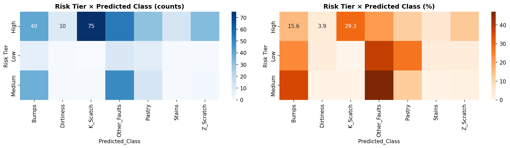
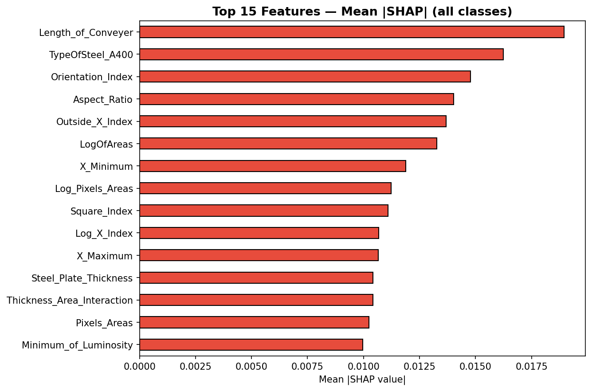
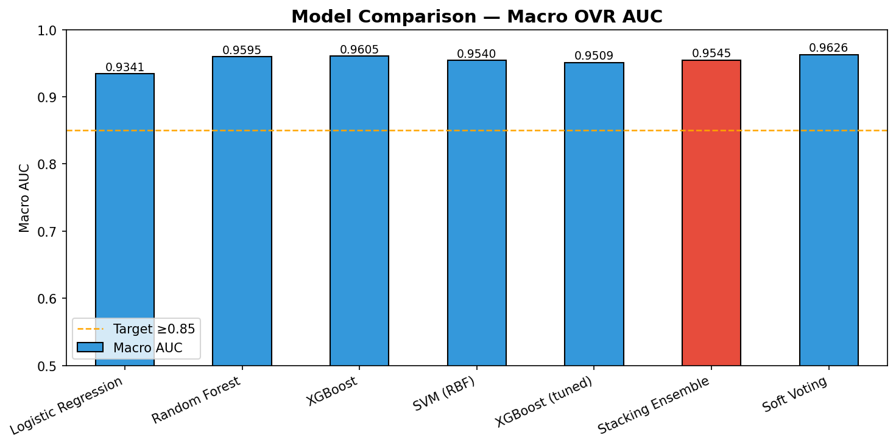
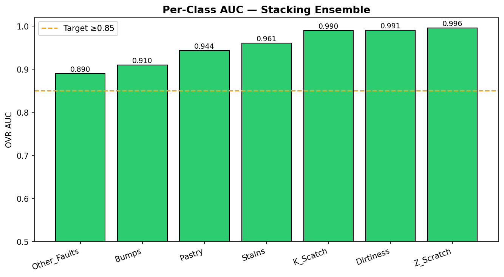
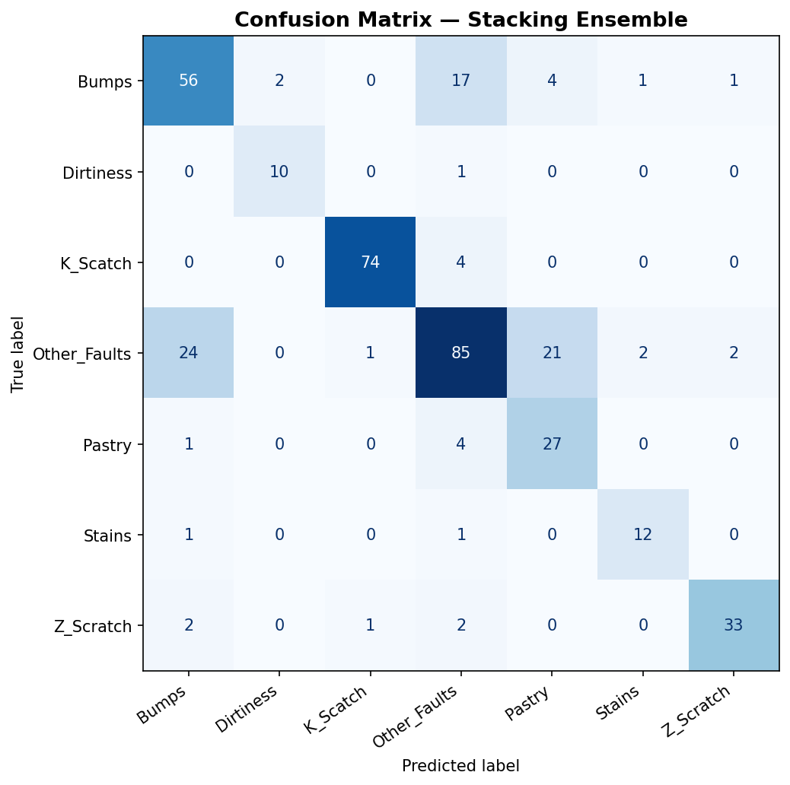
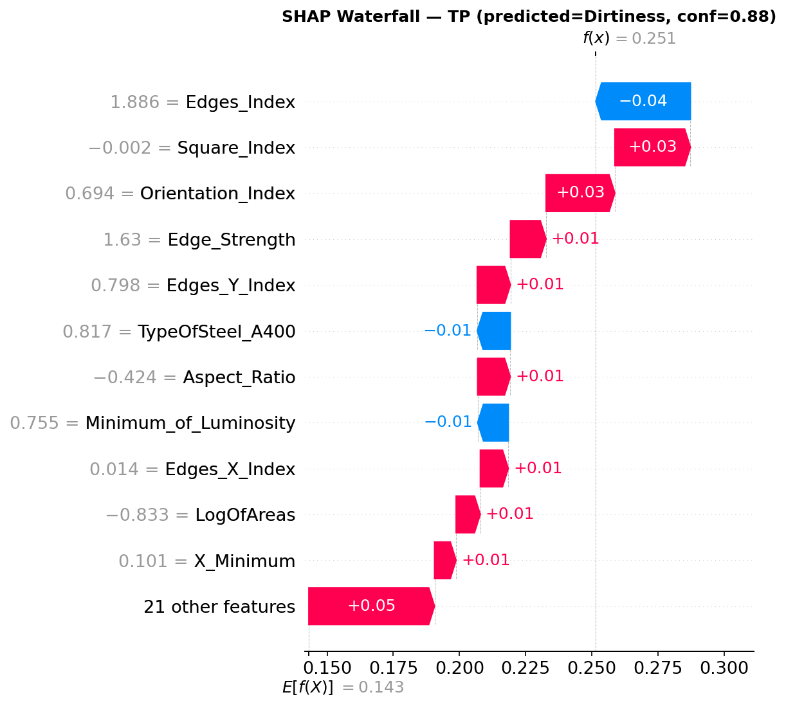
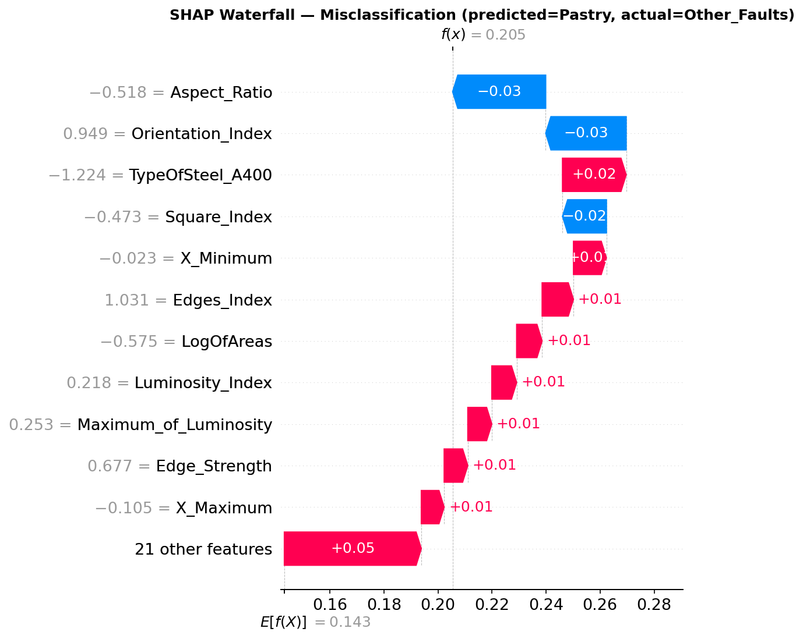

# Steel Plates Defect Prediction — Intelligent Decision Support System

> **AIS431 Final Project** | Mohamed Sherif (221000142) · Mohamed Osama (221001647)

A production-ready machine-learning system that classifies **seven types of surface defects** on steel plates from sensor measurements, explains every prediction with SHAP, and routes each plate to the correct factory action — automatically or via human review — based on a calibrated confidence threshold.

---

## Results at a Glance

| Metric | Value |
|---|---|
| **Macro OVR AUC** (primary) | **0.9545** |
| Overall Accuracy | 79.5% |
| High-confidence automation coverage | 65.8% of plates |
| High-confidence accuracy | 88.3% |
| Model | Stacking Ensemble (RF + SVM + LR meta) |

**Per-class AUC:**

| Defect | AUC | Support (test) |
|---|---|---|
| Z_Scratch | 0.9960 | 38 |
| Dirtiness | 0.9909 | 11 |
| K_Scatch | 0.9898 | 76 |
| Stains | 0.9611 | 22 |
| Pastry | 0.9436 | 49 |
| Bumps | 0.9101 | 76 |
| Other_Faults | 0.8900 | 117 |

---

## Demo

```bash
cd prototype
python -m streamlit run app.py
```



---

## Project Structure

```
steel-plates-idss/
│
├── src/                          # Reusable Python modules
│   ├── config.py                 # All constants and paths
│   ├── feature_engineering.py    # 6 domain-engineered features
│   └── preprocessing.py          # Pipeline factory + data loader
│
├── notebooks/
│   ├── phase1_eda.ipynb          # Exploratory data analysis
│   ├── phase2_data_prep.ipynb    # Feature engineering + train/test split
│   ├── phase3_modelling.ipynb    # Model training + evaluation
│   └── phase4_explainability.ipynb  # SHAP analysis + business recommendations
│
├── prototype/
│   ├── app.py                    # Streamlit web app
│   ├── requirements.txt          # App-specific dependencies
│   └── sample_input.csv          # 5-row example for manual testing
│
├── models/
│   ├── best_model.pkl            # Stacking Ensemble (Git LFS)
│   ├── preprocessing_pipeline.pkl
│   ├── label_classes.pkl
│   ├── label_encoder.pkl
│   ├── feature_names.pkl
│   ├── metrics_summary.json
│   └── recommendation_evidence.json
│
├── reports/
│   ├── business_insights_report.pdf   # 5-page business report
│   ├── executive_summary.pdf          # 1-page non-technical summary
│   ├── generate_business_report.py    # reportlab generator
│   └── generate_executive_summary.py  # reportlab generator
│
├── presentation/
│   ├── final_presentation.pptx        # 13-slide deck
│   └── generate_presentation.py       # python-pptx generator
│
├── figures/                      # All plots (PNG) used in reports + slides
├── data/
│   ├── raw_zip/                  # Original UCI archive files
│   └── data_dictionary.md        # Feature descriptions
│
├── requirements.txt              # Full project dependencies
└── verify_phase2.py / verify_phase3.py  # Smoke-test scripts
```

---

## Dataset

**Steel Plates Faults** — UCI Machine Learning Repository ([ID 198](https://archive.ics.uci.edu/dataset/198/steel+plates+faults))

| Property | Value |
|---|---|
| Samples | 1,941 |
| Original features | 27 sensor measurements |
| Engineered features | 6 (see below) |
| Target | 7 mutually exclusive defect classes |
| Class imbalance | 12:1 (Other_Faults 673 vs Dirtiness 55) |
| Train / test split | 80 / 20, stratified |

### Defect Classes
`Pastry` · `Z_Scratch` · `K_Scatch` · `Stains` · `Dirtiness` · `Bumps` · `Other_Faults`

### Engineered Features

| Feature | Formula | Manufacturing Meaning |
|---|---|---|
| `Defect_Area_Ratio` | `Pixels_Areas / (bounding_box + 1)` | Spread vs localised defect |
| `Luminosity_Range` | `Max_Lum − Min_Lum` | Sharp edge (scratch) vs diffuse (stain) |
| `Aspect_Ratio` | `X_Perimeter / (Y_Perimeter + ε)` | Elongated vs compact defect |
| `Log_Pixels_Areas` | `log1p(Pixels_Areas)` | Scale-invariant size signal |
| `Edge_Strength` | `Edges_Index × Edges_X_Index × Edges_Y_Index` | Combined sharpness |
| `Thickness_Area_Interaction` | `Steel_Plate_Thickness × Log_Pixels_Areas` | Process-level size interaction |

---

## Methodology

### Phase 2 — Data Preparation
- Loaded UCI dataset via local archive (`data/raw_zip/`)
- Verified 0 nulls, 0 duplicates, every row sums to exactly 1 across targets (confirmed multi-class, not multi-label)
- Applied 6 domain-engineered features
- Stratified 80/20 split → `StandardScaler` fitted on train only
- Saved fitted pipeline as `models/preprocessing_pipeline.pkl`

### Phase 3 — Modelling

Four base models trained with `class_weight='balanced'` (XGBoost uses `compute_sample_weight`):

| Model | CV AUC (5-fold) | Test AUC |
|---|---|---|
| Logistic Regression | baseline | — |
| Random Forest | — | — |
| XGBoost | — | — |
| SVM (RBF) | — | — |
| **Stacking Ensemble** | — | **0.9545** |

- **RandomizedSearchCV** (50 iterations, 5-fold stratified) tuned XGBoost
- **StackingClassifier**: RF + SVM base, Logistic Regression meta-learner, `stack_method='predict_proba'`
- Balanced vs unbalanced experiment documented — balanced model chosen for better minority-class recall

### Phase 4 — Explainability

- **SHAP TreeExplainer** on RF base estimator
- Global bar plot (mean |SHAP| across all classes)
- Beeswarm plots for K_Scatch, Stains, Dirtiness
- Three individual waterfall plots: high-confidence TP, edge case, misclassification
- **Risk tier segmentation**: High ≥0.70 · Medium 0.40–0.70 · Low <0.40

#### Risk Tier Performance (test set)
| Tier | Coverage | Accuracy | Factory Action |
|---|---|---|---|
| **High** | 65.8% | 88.3% | Auto pass/reject |
| **Medium** | 26.7% | ~57% | Human review (60s) |
| **Low** | 7.5% | ~50% | Escalate to senior QC |

### Phase 5 — Prototype & Deliverables

- **Streamlit app**: manual entry (27 fields, median defaults) or CSV upload → 7-class probability bar chart + risk badge + SHAP waterfall
- **13-slide PPTX**: generated with python-pptx
- **5-page business report PDF** + **1-page executive summary PDF**: generated with reportlab

---

## Key SHAP Findings



Top features driving predictions:
1. **Length_of_Conveyer** — process-level stage indicator
2. **Defect_Area_Ratio** — spread vs localised defect (engineered)
3. **Log_Pixels_Areas** — scale-invariant size (engineered)
4. **Luminosity_Range** — scratch sharpness (engineered)
5. **Steel_Plate_Thickness** — plate grade + rolling process

---

## Business Recommendations

| # | Recommendation | Priority | Timeline |
|---|---|---|---|
| 1 | Deploy auto pass/reject on High-tier (≥0.70 confidence) | **High** | Immediate |
| 2 | Monthly calibration of Length_of_Conveyer sensors | **High** | Immediate |
| 3 | Safety-net routing for Other_Faults predictions | **High** | Immediate |
| 4 | Monthly retraining with active learning on Medium-tier | **Medium** | 1–3 months |
| 5 | Camera-cleaning alert on consecutive Stains/Dirtiness predictions | **Medium** | 1–3 months |
| 6 | Audit Other_Faults by thickness for sub-type relabelling | Low | 3–6 months |

Full evidence-backed recommendations with quantified impact estimates are in [`reports/business_insights_report.pdf`](reports/business_insights_report.pdf).

---

## Quick Start

### 1. Install dependencies
```bash
pip install -r requirements.txt
```

### 2. Reproduce processed data + models
```bash
# Phase 2 — data prep (generates data/processed/ and models/preprocessing_pipeline.pkl)
jupyter nbconvert --to notebook --execute --inplace notebooks/phase2_data_prep.ipynb

# Phase 3 — modelling (generates models/best_model.pkl, all phase3 figures)
jupyter nbconvert --to notebook --execute --inplace notebooks/phase3_modelling.ipynb

# Phase 4 — explainability (generates all phase4 figures + recommendation_evidence.json)
jupyter nbconvert --to notebook --execute --inplace notebooks/phase4_explainability.ipynb
```

### 3. Regenerate reports
```bash
python reports/generate_business_report.py
python reports/generate_executive_summary.py
python presentation/generate_presentation.py
```

### 4. Run the Streamlit prototype
```bash
cd prototype
python -m streamlit run app.py
```
Open [http://localhost:8501](http://localhost:8501).

**Batch prediction:** upload `prototype/sample_input.csv` (or any CSV with the 27 original feature columns) in the CSV Upload tab.

---

## Model Inference Pipeline

```
Raw input (27 sensor columns)
        │
        ▼
preprocessing_pipeline.pkl
  ├── FunctionTransformer → add 6 features, drop TypeOfSteel_A300
  └── StandardScaler      → zero mean, unit variance
        │
        ▼  32 scaled features
Stacking Ensemble (best_model.pkl)
  ├── Random Forest  (300 trees, class_weight='balanced')
  ├── SVM RBF        (C=10, class_weight='balanced', probability=True)
  └── LR meta-learner on stacked probas
        │
        ▼  7 class probabilities
Risk tier assignment + action recommendation
```

SHAP explanations are computed on the RF base estimator (TreeExplainer-compatible).

---

## Figures

| Figure | Description |
|---|---|
|  | Model comparison — Macro OVR AUC |
|  | Per-class AUC (all 7 classes > 0.89) |
|  | Confusion matrix — Stacking Ensemble |
|  | SHAP global feature importance |
|  | Risk tier × class distribution |
|  | SHAP waterfall — high-confidence TP |
|  | SHAP waterfall — misclassification |

---

## Reproducibility

- `random_state=42` on every randomised operation
- All paths resolved via `src/config.py` (no hardcoded strings)
- Data fetched from bundled `data/raw_zip/` (UCI archive) — no internet required
- Notebooks run top-to-bottom from a clean kernel without in-memory state from other notebooks

---

## Tech Stack

| Library | Purpose |
|---|---|
| scikit-learn 1.8 | LR, RF, SVM, StackingClassifier, preprocessing |
| XGBoost 2.1 | Gradient boosting base model |
| SHAP 0.51 | Feature attribution |
| pandas / numpy | Data manipulation |
| matplotlib / seaborn | Visualisation |
| Streamlit 1.30 | Interactive prototype |
| reportlab | PDF report generation |
| python-pptx | Presentation generation |

---

## Authors

- **Mohamed Sherif** — 221000142
- **Mohamed Osama** — 221001647

*AIS431 — Intelligent Decision Support Systems, 2025/2026*
